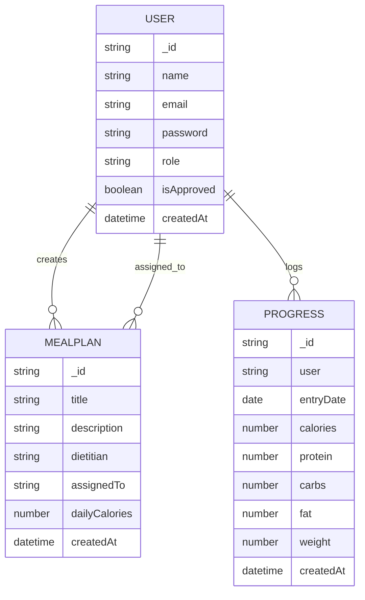

# ER Diagram

## Entity Summary

- **User**: Admin, Dietitian, and User identities with role-based permissions.
- **MealPlan**: Dietitian-authored plans optionally assigned to clients.
- **Progress**: Daily nutrition and weight logs entered by end users.
