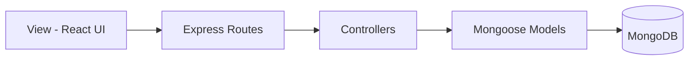

# MVC Pattern

The backend follows an MVC-style separation using **Routes + Controllers + Models**.

## Mapping in This Project

- **View**: React pages/components in `client/src`
- **Controller**: Request handlers in `server/controllers`
- **Model**: Mongoose schemas in `server/models`
- **Routing layer**: Endpoint definitions in `server/routes`
