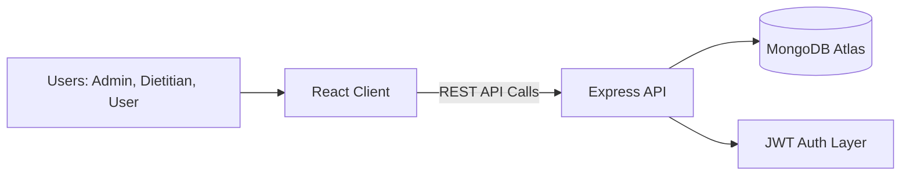

# Project Architecture

This document summarizes the overall architecture of the Nutrition Assistant platform.

## System Overview

## Architecture Notes

- **Frontend**: React + Vite app for role-based dashboards and tracking UI.
- **Backend**: Express API for authentication, user management, meal plans, and progress tracking.
- **Database**: MongoDB stores users, meal plans, and progress records.
- **Security**: JWT authentication with role-based authorization middleware.
