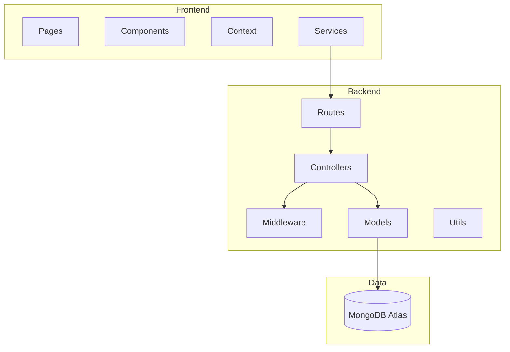

# Technical Architecture

## Layered Architecture

## Technology Stack

- **Client**: React 19, Vite, React Router, Axios, Bootstrap, Chart.js
- **Server**: Node.js, Express, Mongoose, JWT, bcrypt
- **Data**: MongoDB Atlas
