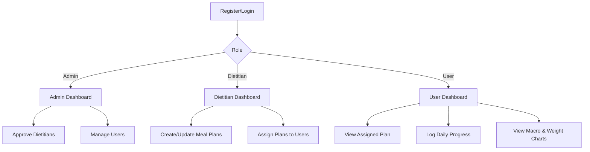

# User Flow

```mermaid
flowchart TD
    A[Register/Login] --> B{Role}
    B -->|Admin| C[Admin Dashboard]
    B -->|Dietitian| D[Dietitian Dashboard]
    B -->|User| E[User Dashboard]

    C --> C1[Approve Dietitians]
    C --> C2[Manage Users]

    D --> D1[Create/Update Meal Plans]
    D --> D2[Assign Plans to Users]

    E --> E1[View Assigned Plan]
    E --> E2[Log Daily Progress]
    E --> E3[View Macro & Weight Charts]
```

## Flow Summary

Authentication determines the role-based entry point, and each role sees only permitted workflows through protected routes and middleware.
